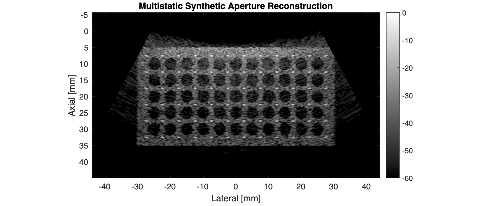

# CurvilinearAngularSpectrumMethod
Angular Spectrum Method and Fourier Beamforming Technique for Curvilinear Arrays

We previously demonstrated a Fourier beamforming technnique that could be used to reconstruct ultrasound images from any arbitrary sequence of transmissions using the angular spectrum method: https://github.com/rehmanali1994/FourierDomainBeamformer. The main limitation of this and other Fourier beamforming approaches is that they are primarily limited to linear/planar arrays. Here we provide the implementation of the angular spectrum method in a polar coordinate system that enables the application of the Fourier beamforming technique in curvilinear arrays.

We provide sample data and algorithms presented in

> R. Ali, “Fourier-based Synthetic-aperture Imaging for Arbitrary Transmissions by Cross-correlation of Transmitted and Received Wave-fields,” Ultrasonic Imaging, p. 016173462110263, Jul. 2021, doi: 10.1177/01617346211026350. [Online]. Available: http://dx.doi.org/10.1177/01617346211026350 *

for the reconstruction ultrasound images using the Fourier beamforming technique and its time-domain equivalent. If you use the code/algorithm for research, please cite the above paper. 

You can reference a static version of this code by its DOI number:

# Code and Sample Datasets
Each image reconstruction algorithm is implemented in both MATLAB and Python:
1) Conventional dynamic-receive beamforming ([FocTxRecon.m](FocTxRecon.m) and [FocTxRecon.py](FocTxRecon.py))
2) Virtual source synthetic aperture ([VirtualSourceRecon.m](VirtualSourceRecon.m) and [VirtualSourceRecon.py](VirtualSourceRecon.py))
3) REFoCUS ([AdjointBasedREFoCUS.m](AdjointBasedREFoCUS.m) and [AdjointBasedREFoCUS.py](AdjointBasedREFoCUS.py))
4) Full-Waveform Reconstruction in Time Domain ([TimeDomFullWaveRecon.m](TimeDomFullWaveRecon.m) and [TimeDomFullWaveRecon.py](TimeDomFullWaveRecon.py)) and Frequency Domain ([FreqDomFullWaveRecon.m](FreqDomFullWaveRecon.m) and [FreqDomFullWaveRecon.py](FreqDomFullWaveRecon.py))

Please see any supporting functions in [beamforming_functions](beamforming_functions).

**Please download the sample data (FocTxDataset.mat) under the [releases](https://github.com/rehmanali1994/FourierDomainBeamformer/releases) tab for this repository, and place that data in the main directory ([FourierDomainBeamformer](https://github.com/rehmanali1994/FourierDomainBeamformer)).**

# Sample Results
We show the following multistatic synthetic aperture image reconstruction using the Fourier beamforming technique with the polar form of the angular spectrum method:

The Fourier beamforming technique provided is equivalent to the time-domain cross-correlation process below:

We also acquired channel data in-vivo using focused transmit beams on a clinical scanner to obtain the following synthetic aperture image reconstruction:

We show the same time-domain cross-correlation process in-vivo as well:

