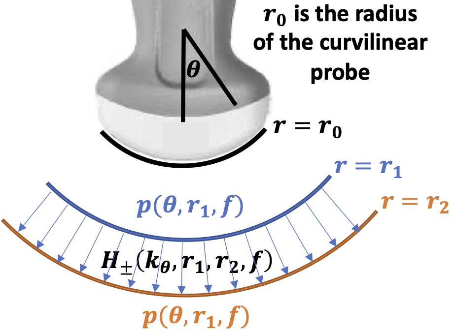
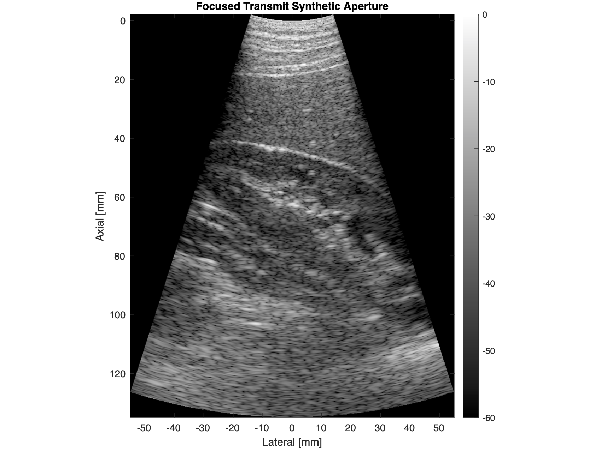

# CurvilinearAngularSpectrumMethod
Angular Spectrum Method and Fourier Beamforming Technique for Curvilinear Arrays

{:height="50%" width="50%"}

We previously demonstrated a Fourier beamforming technnique that could be used to reconstruct ultrasound images from any arbitrary sequence of transmissions using the angular spectrum method: https://github.com/rehmanali1994/FourierDomainBeamformer. The main limitation of this and other Fourier beamforming approaches is that they are primarily limited to linear/planar arrays. Here we provide the implementation of the angular spectrum method in a polar coordinate system that enables the application of the Fourier beamforming technique in curvilinear arrays.

We provide sample data and algorithms presented in

> Ali, R., Dahl, J. “Angular Spectrum Method for Curvilinear Arrays: Theory and Application to Fourier Beamforming,” *Manuscript in preparation for JASA Express Letters.*

for the reconstruction ultrasound images using the Fourier beamforming technique. If you use the code/algorithm for research, please cite the above paper. 

You can reference a static version of this code by its DOI number:

# Code and Sample Datasets
The angular spectrum method for the downward propagation of transmit and receive wavefields is implemented in both MATLAB ([propagate_polar.m](propagate_polar.m)) and Python ([propagate_polar.py](propagate_polar.py)). The following example scripts/tutorials are provided:
1) A multistatic synthetic aperture image reconstruction using a Field II-simulated dataset ([FreqDomShotGatherMig_Curvilinear_FieldII.m](FreqDomShotGatherMig_Curvilinear_FieldII.m) and [FreqDomShotGatherMig_Curvilinear_FieldII.py](FreqDomShotGatherMig_Curvilinear_FieldII.py)).
2) The equivalent time-domain reconstruction process shown using a single-element transmission ([TimeDomShotGatherMig_FieldII.m](TimeDomShotGatherMig_FieldII.m) and [TimeDomShotGatherMig_FieldII.py](TimeDomShotGatherMig_FieldII.py)).
3) A focused synthetic aperture image reconstruction for an abdominal imaging example ([FreqDomShotGatherMig_Curvilinear_5C1.m](FreqDomShotGatherMig_Curvilinear_5C1.m) and [FreqDomShotGatherMig_Curvilinear_5C1.py](FreqDomShotGatherMig_Curvilinear_5C1.py)).
4) The equivalent time-domain reconstruction process shown using a single focused-transmit beam ([TimeDomShotGatherMig_FieldII.m](TimeDomShotGatherMig_FieldII.m) and [TimeDomShotGatherMig_FieldII.py](TimeDomShotGatherMig_FieldII.py)).

**Please download the sample data (FieldII_AnechoicLesionFullSynthData.mat and SiemensData5C1_Kidney2.mat) under the [releases](https://github.com/rehmanali1994/CurvilinearAngularSpectrumMethod/releases) tab for this repository, and place that data in the main directory ([CurvilinearAngularSpectrumMethod](https://github.com/rehmanali1994/CurvilinearAngularSpectrumMethod)).**

# Sample Results
We show the following multistatic synthetic aperture image reconstruction using the Fourier beamforming technique with the polar form of the angular spectrum method:

The Fourier beamforming technique provided is equivalent to the time-domain cross-correlation process shown below (only a single-element transmission is shown here):

We also acquired channel data in-vivo using focused transmit beams on a clinical scanner to obtain the following synthetic aperture image reconstruction:

We show the same time-domain cross-correlation process in-vivo with a single focused transmit beam:

